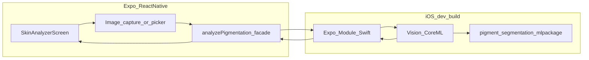

# Skin analyzer (iOS / CoreML) — high-level design

This document is the **Expo app** anchor for on-device pigmentation segmentation. Canonical training and CoreML export live in the sibling repo **`skin_analyzer_model`**.

## Operational workflow

Step-by-step commands (train → export → Xcode → native module): **[SKIN_ANALYZER_WORKFLOW.md](./SKIN_ANALYZER_WORKFLOW.md)**. You can run **Phase A** (prebuild, dev client) while training is still running.

## Goals (POC → product)

- **POC (current):** Run **`pigment_segmentation`** (CoreML) on a **still image**; show a **mask** and a single **aggregate** metric (see [What the current % means](#what-the-current--means)). All processing **on-device** for privacy; **offline** after assets are bundled.
- **Product (target):** Support **interpretable, condition-aware** summaries for common pigmentation presentations — e.g. **Melasma**, **Solar lentigines (sun/age spots)**, **Freckles (ephelides)**, **Post-inflammatory hyperpigmentation (PIH)** — surfaced as **separate estimated area (or confidence) shares**, not a black-box single number. This requires **new labels, architecture, and validation** in `skin_analyzer_model` (not just app UX).
- **Copy / UX:** Educational / progress-tracking tone only — **no clinical diagnostic claims** in UI strings. Condition names are **patterns the model was trained to associate with image regions**, not a doctor’s diagnosis.
- **Model:** Replace **dummy** weights with **clinic-grade** exports as data and validation mature; version the **`.mlpackage`** and the **JS/native contract** when outputs change (binary mask → multi-class / multi-head).

## What the current % means

The trained **U-Net** today is **binary segmentation**: one channel = “pigment-like” vs background on the **512×512** crop. The app’s **“Affected area (estimate)”** is the **fraction of pixels in that crop whose mask value ≥ a fixed threshold** (currently 0.5), converted to a **percentage**.

- It does **not** mean “59% melasma” or any **specific** condition.
- It is **not** yet decomposed into Melasma vs Freckles vs Lentigines vs PIH unless the **model and training data** provide separate channels or heads (see [Roadmap: condition-specific breakdown](#roadmap-condition-specific-breakdown)).

**Near-term app copy:** Prefer labels like **“Pigmented area (estimate)”** or **“Model estimate: pigmented pixels in frame”** until per-condition outputs exist.

## Roadmap: condition-specific breakdown

**Desired UX example:** “Freckles ~5% · Solar lentigines ~40% · …” with short explanations that these are **model estimates** over the analyzed crop.

### 1. Data & annotations (upstream, `skin_analyzer_model`)

| Approach | Pros | Cons |
|--------|------|------|
| **Multi-class segmentation** (one mask, each pixel assigned a class: background + N conditions) | Direct per-condition **area %** from pixels | Hard when **regions overlap** (e.g. PIH + background sun damage); needs **clear ontology** and adjudication |
| **Multi-channel / multi-label masks** (per pixel, multiple channels or soft labels) | Handles **overlap** better | More annotation cost; export/I/O more complex |
| **Separate binary models** per condition | Simpler labels per model; can iterate per condition | Multiple bundles, latency/size; calibration across models |
| **Image-level multi-label classifier** + optional mask | Cheaper labels (“present/absent”); no precise % without localization | **Weak** spatial breakdown unless combined with a mask branch |

**Conditions of interest (product list):** Melasma, Solar lentigines, Freckles (ephelides), PIH — plus **background** / **other pigment** / **uncertain** buckets as needed for label balance.

**Labeling mode (product):** **Exclusive** classes for v1 of the breakdown UI — each pixel belongs to at most one condition (plus background) so the app can show a simple row-per-class list without overlap visualization. (Overlapping biology can still be approximated by picking a primary class per region at annotation time.)

**Still TBD with clinical input:** photography SOP; annotator workflow; **minimum N** per class; handling **“other / none of the above”** pixels.

**App today:** [`skin-analyzer`](../app/(app)/skin-analyzer.tsx) shows that card **after the user picks a photo** and analysis returns (demo: **placeholder** percentages until native supplies real `conditions`; see `src/services/skin-analyzer/conditionTypes.ts`).

### 2. Model & export

- Extend **`skin_analyzer_model`** (new configs, heads, loss, `export_to_coreml.py`) to emit either **multiple masks**, a **single multi-class map**, and/or **tabular condition scores**.
- **Core ML:** new or updated **`.mlpackage`**(s); bump **`tap-skin-analyzer`** to parse new outputs and return a **structured object** to JS.

### 3. App contract (evolution)

Extend the native/TS result shape (names illustrative):

```ts
export type ConditionAreaEstimate = {
  /** Stable id, e.g. "solar_lentigines" */
  id: string;
  /** User-facing label */
  label: string;
  /** 0–100, area fraction of crop for this class (definition must match training) */
  areaPercent: number;
};

export type PigmentAnalysisResult = {
  /** Binary or merged mask for overlay (optional) */
  maskBase64?: string;
  /** Legacy single-track metric; keep for backward compatibility until removed */
  affectedPercent?: number;
  /** When multi-class / multi-head model is shipped */
  conditions?: ConditionAreaEstimate[];
  /** Model/schema version for UI feature flags */
  schemaVersion?: string;
};
```

- **Feature flag / version gating:** Older bundles only populate `affectedPercent`; newer bundles populate **`conditions`** and clearer copy.
- **Android / web:** Same TS shape; native fill only where ML exists.

### 4. UX & compliance

- Short **Disclaimer** block: estimates only, not a diagnosis; lighting and fit affect results; follow with a clinician for medical decisions.
- Optionally show **confidence** or **“insufficient evidence”** per class when the model supports it.

## Related: `PROJECT_SUMMARY.md`

The sibling repo summary describes **today’s** binary U-Net + severity regressor. **Condition breakdowns** are a **forward-looking** capability: plan training data and evaluation in **`skin_analyzer_model`** before the app can honestly show per-condition percentages.

## Upstream references

| Document | Path (from this repo) |
|----------|------------------------|
| Integration flow (capture → preprocess → CoreML → overlay) | [`../../skin_analyzer_model/docs/IOS_APP_INTEGRATION.md`](../../skin_analyzer_model/docs/IOS_APP_INTEGRATION.md) |
| Export command, Xcode embedding, Vision pipeline | [`../../skin_analyzer_model/docs/IOS_DEPLOYMENT.md`](../../skin_analyzer_model/docs/IOS_DEPLOYMENT.md) |

## Architecture (high level)



- **Expo Go:** cannot ship the custom native CoreML bridge or reliably exercise bundled **`.mlpackage`** the same way as a **development** or **release** IPA. Use **`expo-dev-client`** + local Xcode builds (or EAS Build) for integration testing.
- **Android:** **CoreML does not apply.** The same screen can show an **iOS-only** message or a future **non-CoreML** path (e.g. ONNX/TFLite or server inference — out of scope for this design).

## Model lifecycle

1. **Train / export** in `skin_analyzer_model` using the documented pipeline (e.g. `export_to_coreml.py` → **`exports/pigment_segmentation.mlpackage`**).
2. **Dummy weights:** acceptable for validating **export codegen** and **app integration**; document the artifact version in repo notes when swapping to production weights.
3. **Versioning:** keep a stable resource name (e.g. `pigment_segmentation.mlpackage`) or bump explicitly when I/O shapes change (requires JS + Swift contract updates).

## iOS project steps (ordered)

1. **`expo-dev-client`** is added to this app (`package.json` + `app.config.js` → `plugins`). Use **`npx expo start --dev-client`** with a dev build ([Expo dev client docs](https://docs.expo.dev/develop/development-builds/introduction/)).
2. Run **`npm run prebuild:ios`** (or `npx expo prebuild --platform ios`) to generate **`ios/`** (or use EAS Build which runs prebuild in CI). See **[SKIN_ANALYZER_WORKFLOW.md](./SKIN_ANALYZER_WORKFLOW.md)**.
3. Open **`ios/*.xcworkspace`** in **Xcode**.
4. Drag **`pigment_segmentation.mlpackage`** into the app target (see **IOS_DEPLOYMENT**). Confirm **`pigment_segmentation.mlpackage`** appears in **Copy Bundle Resources** (Xcode compiles it for the app bundle on build).
5. Implement inference in **Swift** using **Vision** + **`VNCoreMLRequest`** (or direct **CoreML** prediction) with **input size and normalization** matching **IOS_APP_INTEGRATION** (e.g. 512×512, RGB).
6. Expose a minimal API to JavaScript via an **Expo Module** (recommended) or a thin native module.
7. From **`skin-analyzer`** (or evolving **`face-map`**): use **`expo-image-picker`** (or `expo-camera`) → pass file URI to native → render mask (e.g. base64 PNG overlay or `Image` + opacity).

## Native module contract

**Implementation today:** [`tap-skin-analyzer`](../modules/tap-skin-analyzer/) (Expo module) + [`src/services/skin-analyzer/pigmentation.ts`](../src/services/skin-analyzer/pigmentation.ts) — **`analyzePigmentation`** on **iOS** calls native Core ML; other platforms throw **`SkinAnalyzerNotAvailableError`**.

Result shape today matches the **binary** model: `maskBase64`, `affectedPercent`. When multi-condition models ship, extend as in [Roadmap: condition-specific breakdown](#roadmap-condition-specific-breakdown).

- **Errors:** missing model in bundle, bad URI, preprocess/inference failure → surfaced as **`SkinAnalyzerNotAvailableError`** or message string; keep **user-safe** copy in the UI.

## JS layer

- **Facade:** `src/services/skin-analyzer/` — single import for screens; **iOS dev build** uses native module; Android/web → **not available**.
- **Screens:** [`app/(app)/skin-analyzer.tsx`](../app/(app)/skin-analyzer.tsx) — dashboard Quick Action; render **`conditions[]`** when present, else **`affectedPercent`** with **clear non-diagnostic** labels.

## UX flow (target)

1. User opens **Face / Skin Analyzer** from dashboard.
2. Short onboarding copy (lighting, framing) — align with **IOS_APP_INTEGRATION** recommendations.
3. Capture or pick image → preprocess (512×512 parity) → native inference → overlay + metrics.
4. **Today:** one **pigmented-area** % + mask. **Next:** per-condition **area estimates** + disclaimer + optional “how to interpret.”
5. Optional later: save snapshot to **Supabase Storage** / link to **treatments**.

## Risks and constraints

| Risk | Mitigation |
|------|------------|
| **Large model** (~60–120 MB class per upstream docs) | App size, download time; consider on-demand download post-install only if product requires it |
| **Preprocess mismatch** vs training | Pixel-perfect parity with `skin_analyzer_model` preprocessing before trusting metrics |
| **Expo Go** | Use dev client for all CoreML work |
| **Android** | Stub UI; separate ML stack or server path later |
| **Regulatory / labeling** | Keep UI non-diagnostic; legal review before marketing |

## Related app docs

- **[SETTINGS_FEATURES.md](./SETTINGS_FEATURES.md)** — product backlog and status.
- **[SCREEN_PARITY.md](./SCREEN_PARITY.md)** — Flutter vs Expo notes.
- **[EXPO_ROUTES.md](./EXPO_ROUTES.md)** — `/skin-analyzer` route.
- **[MIGRATION_PLAN.md](./MIGRATION_PLAN.md)** — “Planned capability — Skin analyzer”.

## Maintenance

When adding universal links or renaming the route, update **EXPO_ROUTES.md** and this doc’s cross-links. Command checklist updates go in **SKIN_ANALYZER_WORKFLOW.md**.
